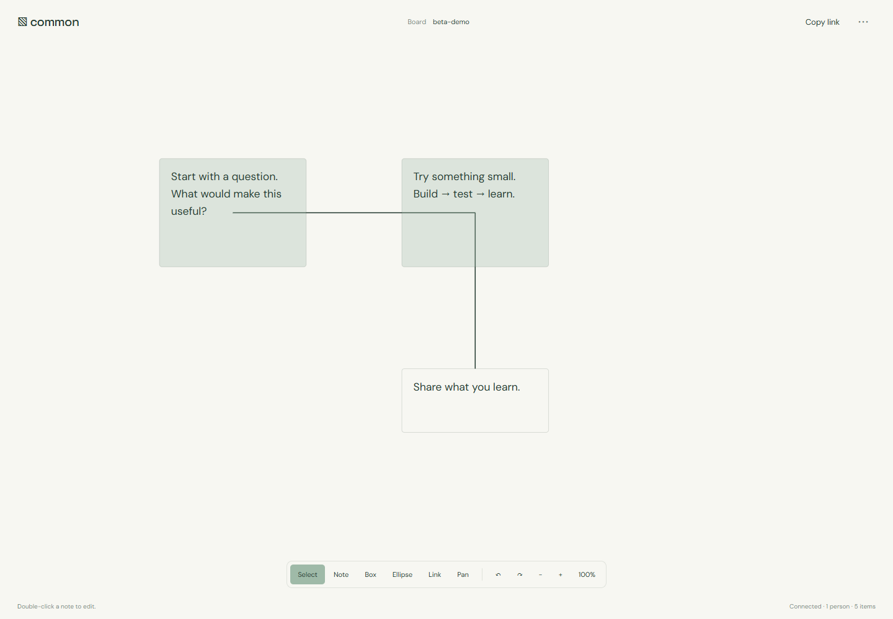

# Common · shared-canvas

A quiet shared whiteboard that keeps your edits when the connection drops.

[](https://github.com/A-Mardi/shared-canvas/actions/workflows/build.yml)

**Working local beta · 0.1.0.** Go, React, and TypeScript, with Yjs.



## What works

- Notes, boxes, ellipses, connectors, dragging, pan, zoom, and local undo/redo.
- Concurrent note editing with Yjs text CRDTs; IndexedDB stores the local document.
- Room links, remote cursors, reconnect synchronization, and JSON import/export.
- Go WebSocket relay with a checksummed append log and sync-before-broadcast persistence.

## Run

Requires Node.js 22.12+ and Go 1.26+. From the repository root:

```sh
npm ci --prefix web
npm run build --prefix web
node scripts/start.mjs
```

Open http://127.0.0.1:8091. The launcher builds Go and serves the frontend from one origin. Set GO_BINARY if Go is not on PATH. You can pass `--addr`, `--web`, and `--data` to the launcher. Local data is stored in ignored `.data/`; keep it when restarting.

Open the same board link in two tabs. Add a note, edit it in both, then disable networking in one tab. Reconnect to see the text merge.

For frontend development, leave the service running and use `npm run dev --prefix web` at http://127.0.0.1:5176; Vite proxies the service routes.

## Verify

```sh
go -C server test ./...
go -C server vet ./...
npm run build --prefix web
npx --prefix web playwright install chromium
npm test --prefix web
```

Browser tests launch an isolated service and temporary data directory. CI additionally runs Go's race detector. Go tests cover partial-log recovery and checksum corruption. The Playwright scenario uses two isolated browser contexts, edits the same note while one is offline, checks convergence after reconnect, reloads the board, and checks mobile overflow. This validates two-peer behavior; the 12-peer limit is a configured ceiling, not a measured capacity result.

## Beta boundaries

Designed for trusted collaborators: there are no accounts, access controls, or private-room guarantees. The server accepts opaque Yjs updates. Limits are 12 connections per room, 32 loaded rooms, 2 MiB per update, and a 32 MiB log per room. The UI limits boards to 500 items. Reconnect sends full document state; log compaction is not implemented. Offline editing works in an already loaded tab; there is no service worker guaranteeing an offline page load. Desktop editing is the primary experience; touch has pan and zoom buttons.

## Engineering notes

[Architecture](docs/ARCHITECTURE.md) explains the boundaries and tradeoffs. [Roadmap](docs/ROADMAP.md) separates implemented features from future work. [Contributing](CONTRIBUTING.md) covers checks and reproducible reports.

## License

[MIT](LICENSE). Dependency licenses remain their own; see [third-party notices](THIRD_PARTY_NOTICES.md).
